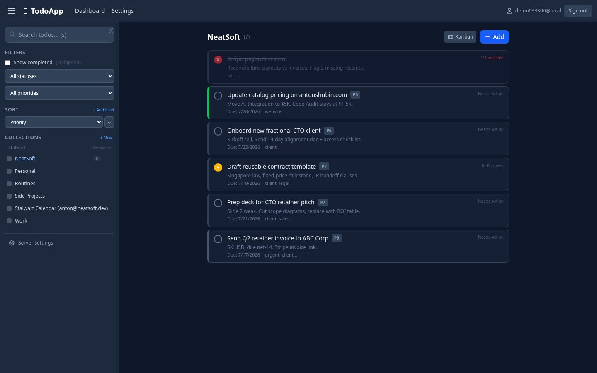
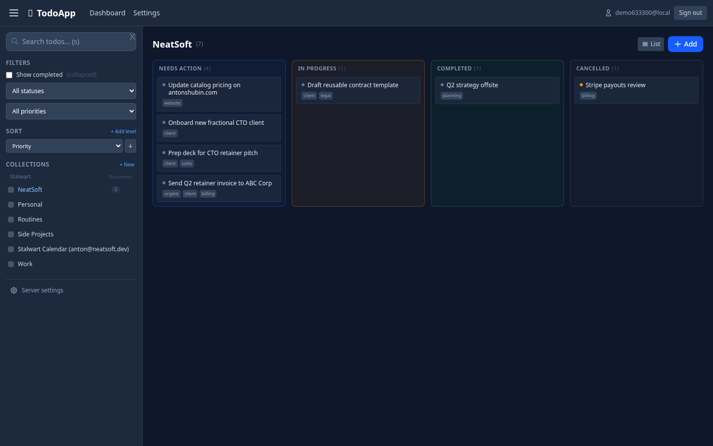
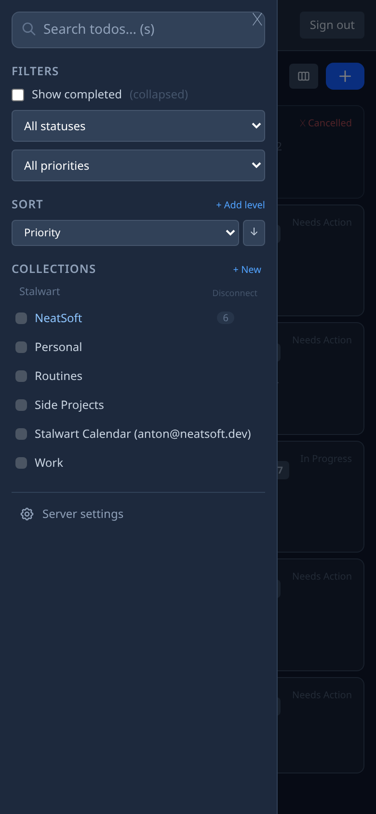
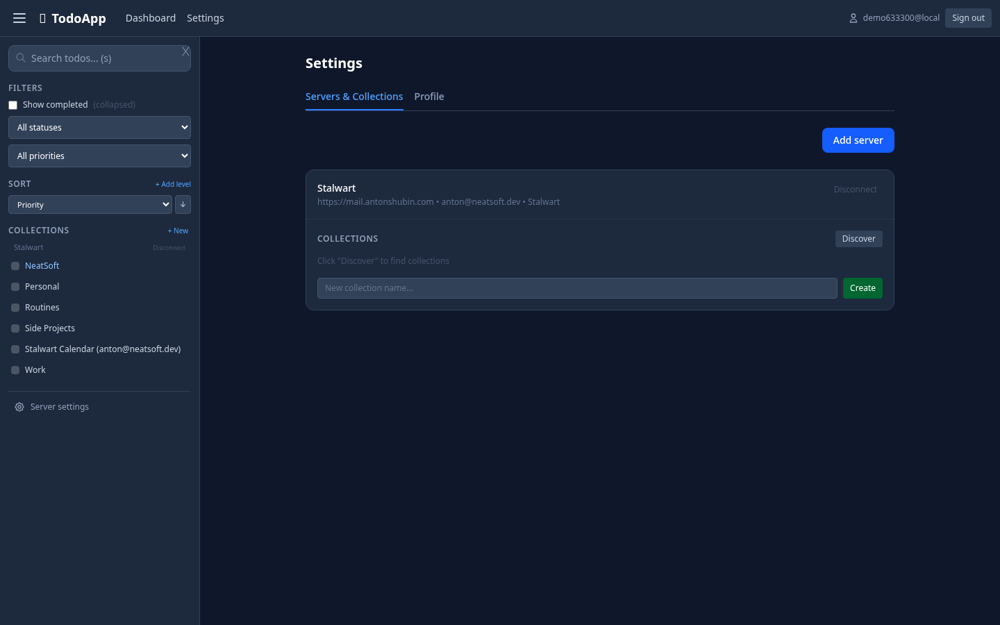

# caldav-tasks-web

A self-hosted PWA for managing VTODO tasks on any CalDAV server.

Point it at Radicale, Stalwart, Nextcloud, or Baikal — anything that
speaks [RFC 4791](https://datatracker.ietf.org/doc/html/rfc4791). Edit
your tasks in the browser the same way you do on Android with
[Tasks.org](https://tasks.org/).

[Live demo](https://todos.antonshubin.com) ·
[Repository](https://github.com/spy4x/caldav-tasks-web)



---

## Why

Tasks.org is the best Android task app and it syncs to CalDAV cleanly.
There is no web UI for it. This fills the gap.

If you already run Radicale or Stalwart for your calendars and tasks,
this gives you a touch-first PWA on top of the same data — no data
migration, no second source of truth, installable on mobile from the
browser.

## Features

- Multiple CalDAV servers per account, multiple calendars per server,
  in one web UI
- Full VTODO editing: summary, description, status, priority, due date,
  start date, categories, location, recurrence, percent complete
- Inline tag filter, full-text search across summary / description /
  categories
- Filter by status or priority, hide completed, multi-sort
- Kanban view — drag todos between status columns
- Collection CRUD — create, rename, delete calendars in-place
- Server passwords encrypted with AES-GCM at rest (key from
  `ENCRYPTION_SECRET`)
- Mobile-first sidebar with overlay, works as an installed PWA
- Self-host with one Deno binary plus SQLite — no Node, no npm runtime

## Server compatibility

| Server    | Status                                 |
| --------- | -------------------------------------- |
| Radicale  | Tested in production                   |
| Stalwart  | Tested in production (since 2026-07)   |
| Nextcloud | CalDAV-compliant, expected to work     |
| Baikal    | CalDAV-compliant, expected to work     |
| Tasks.org | Tested as a peer (round-trips cleanly) |

The CalDAV protocol is standardized (RFC 4791) so any conforming
server should work.

## Stack

| Layer    | Tech                                                  |
| -------- | ----------------------------------------------------- |
| Runtime  | Deno 2.2 — single binary, no Node                     |
| API      | Hono, CQRS-ready bus in `libs/shared/cqrs/`           |
| Frontend | Preact + Signals (no hooks), Tailwind v4, Vite        |
| DB       | SQLite via `@db/sqlite` FFI                           |
| CalDAV   | Adapter layer in `apps/api/services/caldav/`          |
| Auth     | PBKDF2 with pepper, HttpOnly session cookies          |
| Deploy   | `rsync` to homelab, then Docker Compose under Traefik |

## Screenshots







## Quick start (local)

```bash
git clone https://github.com/spy4x/caldav-tasks-web
cd caldav-tasks-web
cp .env.example .env                       # set AUTH_PEPPER, AUTH_COOKIE_SECRET, ENCRYPTION_SECRET
deno task db:migrate
deno task dev                              # API :8080 + frontend :5173
```

Open `http://localhost:5173`, sign up, add your CalDAV server.

## Production deploy

Comes with a `Dockerfile` and `compose.yml` wired for Traefik and
Let's Encrypt. `deno task deploy` does the whole loop:

1. Build the frontend
2. Rsync to the homelab (SSH target in `infra/envs/.env.prod`)
3. `docker compose up -d --build` on the remote

See [`docs/1.overview.md`](docs/1.overview.md) for the full architecture.

Place your production secrets directly on the deploy target (the repo
does not store them — `.env.prod` is gitignored and a template lives at
`infra/envs/.env.prod.example`).

## Environment variables

| Var                  | Purpose                                                                                   |
| -------------------- | ----------------------------------------------------------------------------------------- |
| `AUTH_PEPPER`        | PBKDF2 pepper for password hashing                                                        |
| `AUTH_COOKIE_SECRET` | Session cookie signing key                                                                |
| `ENCRYPTION_SECRET`  | AES-GCM key for CalDAV passwords at rest                                                  |
| `DB_PATH`            | SQLite file path (default `./data/todoapp.db`)                                            |
| `CORS_ORIGIN`        | Allowed frontend origin                                                                   |
| `COOKIE_INSECURE`    | Set to `1` for local HTTP testing only (escape hatch for headless screenshot scripts, CI) |

Production needs all three secrets. See `.env.example` and
`infra/envs/.env.prod.example` for placeholders.

## Development

```bash
deno task check                                 # fmt + lint + typecheck
deno test apps/api/services/caldav/parse.test.ts
```

The CalDAV parser tests cover Radicale (default namespace), lowercase
`d:` prefixes, and Stalwart (uppercase `D:` / `A:`). Adding a Nextcloud
or Baikal adapter is a new class in `apps/api/services/caldav/` and a
case in `getAdapter()` — the route layer stays untouched.

## Project layout

```
apps/api/         Hono API, CalDAV adapters, middleware
apps/web/         Preact PWA (components, pages, signals)
libs/server/db/   SQLite wrapper + migrations
libs/shared/      Types, helpers, CQRS buses
infra/            Deploy scripts, env templates, rsync config
docs/             Architecture overview
```

## Architecture notes

- **CQRS** — business logic uses command / query buses in
  `libs/shared/cqrs/`. Not over-engineered for the current scope, but
  no big refactor when features grow.
- **CalDAV adapter layer** — `CalDAVAdapter` interface in
  `apps/api/services/caldav/+index.ts`. Today's implementations:
  `RadicaleAdapter`, `StalwartAdapter`. Adding a new server is one
  class, not a chain of `if (serverType === ...)` blocks.
- **preact-signals, not hooks** — state lives in signals, components
  subscribe explicitly, no virtual DOM tree of hooks.
- **SQLite, swappable** — `DbService` is the abstraction. Postgres is
  one implementation away.
- **Fail-open** — non-critical external calls (analytics, monitoring)
  guarded with `|| true`. Primary operations never block on
  auxiliaries.

## Status

Stable. The [deployed instance](https://todos.antonshubin.com) holds
5 calendars and 140+ todos and migrated from Radicale to Stalwart in
2026-07 without any data movement.

## Security

See [`SECURITY.md`](SECURITY.md) for the threat model, supported
versions, and how to report vulnerabilities. **Do not open a public
GitHub issue for security-relevant findings** — email
security@neatsoft.dev.

## License

[MIT](LICENSE).
