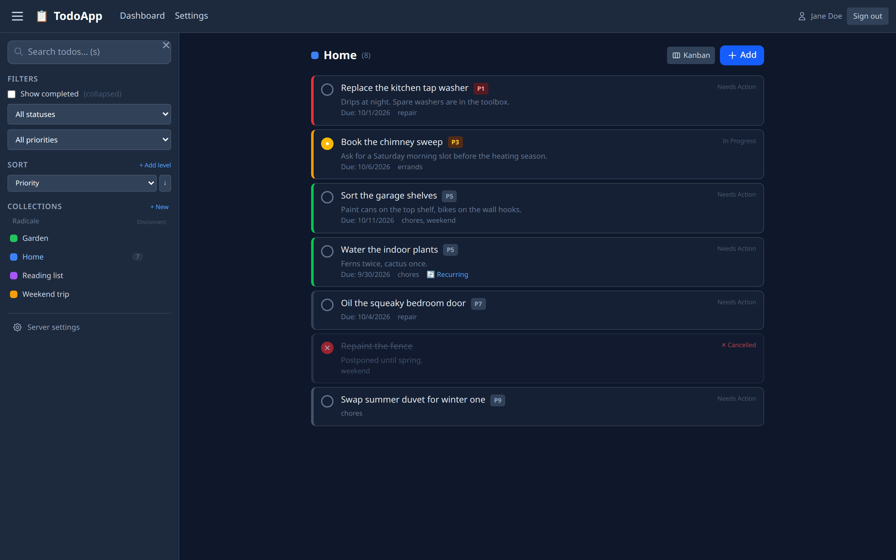
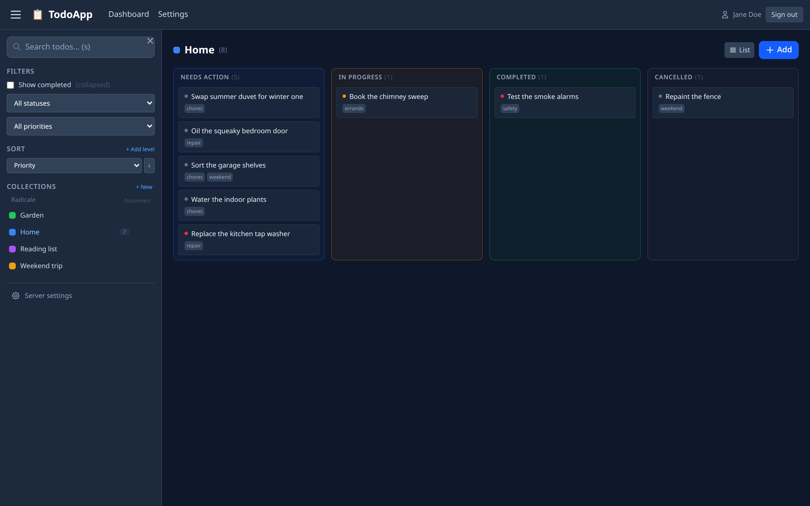

<div align="center">

# caldav-tasks-web

**The web UI Tasks.org never had: manage your CalDAV tasks in the browser.**

[](LICENSE)

[Features](docs/features.md) · [Self-hosting](docs/self-hosting.md) ·
[Architecture](docs/architecture.md) · [Contributing](CONTRIBUTING.md)





</div>

You connect your CalDAV server once, and every task list on it shows up in the browser: edit a
task, tag it, filter and sort the list, or drag cards across a kanban board. Changes are written
straight back to the server, so [Tasks.org](https://tasks.org/) on your phone sees them on its next
sync. There is nothing to migrate and no second copy of your tasks.

It exists because Tasks.org is a great Android task app that syncs to CalDAV cleanly but has no
web UI. I use it with my own Radicale server.

## Why caldav-tasks-web

- **Your server stays the source of truth.** Tasks live on your CalDAV server as standard VTODOs;
  the app keeps only your account, sessions and server list in SQLite.
- **Full VTODO editing.** Summary, description, status, priority, due and start dates, categories,
  location, recurrence and percent complete.
- **Find anything fast.** Full-text search, tag filter, status and priority filters, multi-level
  sort, all kept in the URL.
- **List or kanban.** Drag a task between status columns; create, rename and delete calendars in
  place.
- **Several servers, one page.** Multiple CalDAV servers per account, multiple calendars per
  server. Server passwords are encrypted at rest with AES-GCM through Web Crypto.
- **Phone-first.** A touch-friendly sidebar drawer, and a web manifest to install it from the
  browser.

**Use it if** you keep tasks on a CalDAV server and want to edit them from any browser. **Skip it
if** your server is Stalwart (broken today, see
[#10](https://github.com/spy4x/caldav-tasks-web/issues/10)) or you want a hosted service.

## Server compatibility

| Server            | Status                                                                         |
| ----------------- | ------------------------------------------------------------------------------ |
| Radicale          | Tested in production                                                           |
| Nextcloud, Baikal | CalDAV-compliant, expected to work, untested                                   |
| Stalwart          | Broken, not usable: [#10](https://github.com/spy4x/caldav-tasks-web/issues/10) |

Tasks.org round-trips cleanly as a peer on the same server. Details:
[features.md](docs/features.md#server-compatibility).

## Quick start

```bash
git clone https://github.com/spy4x/caldav-tasks-web
cd caldav-tasks-web
cp .env.example .env                       # set AUTH_PEPPER, AUTH_COOKIE_SECRET, ENCRYPTION_SECRET
deno task db:migrate
deno task dev                              # API :8080 + frontend :5173
```

Open `http://localhost:5173`, sign up, add your CalDAV server. For Docker, Traefik and the deploy
script, see [self-hosting.md](docs/self-hosting.md).

## Configuration

The three secrets production needs:

| Variable             | Purpose                                  |
| -------------------- | ---------------------------------------- |
| `AUTH_PEPPER`        | PBKDF2 pepper for password hashing       |
| `AUTH_COOKIE_SECRET` | Session cookie signing key               |
| `ENCRYPTION_SECRET`  | AES-GCM key for CalDAV passwords at rest |

`DB_PATH`, `CORS_ORIGIN` and `COOKIE_INSECURE` are optional: see
[self-hosting.md](docs/self-hosting.md#environment-variables).

## Development

```bash
deno task dev      # API and frontend with reload
deno task check    # fmt + lint + typecheck
```

See [CONTRIBUTING.md](CONTRIBUTING.md) for tests and adding a server adapter, and
[SECURITY.md](SECURITY.md) to report a vulnerability privately.

## Built by

I'm [Anton Shubin](https://antonshubin.com), a senior full-stack engineer and tech lead.
caldav-tasks-web is one of the tools I build and use on my own servers. Need something like it
built for your product? [That's my day job →](https://antonshubin.com)

Licensed under [MIT](LICENSE). Copyright (c) 2026 Anton Shubin.

---

Made by Anton Shubin · [antonshubin.com/tools](https://antonshubin.com/tools)
