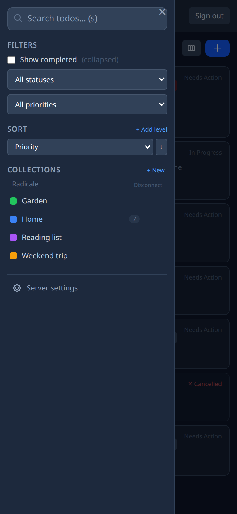
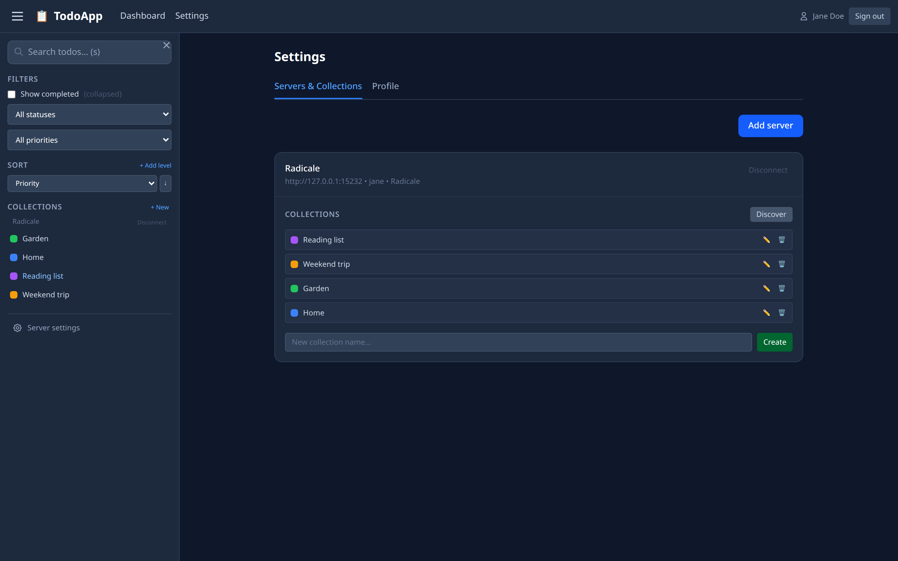
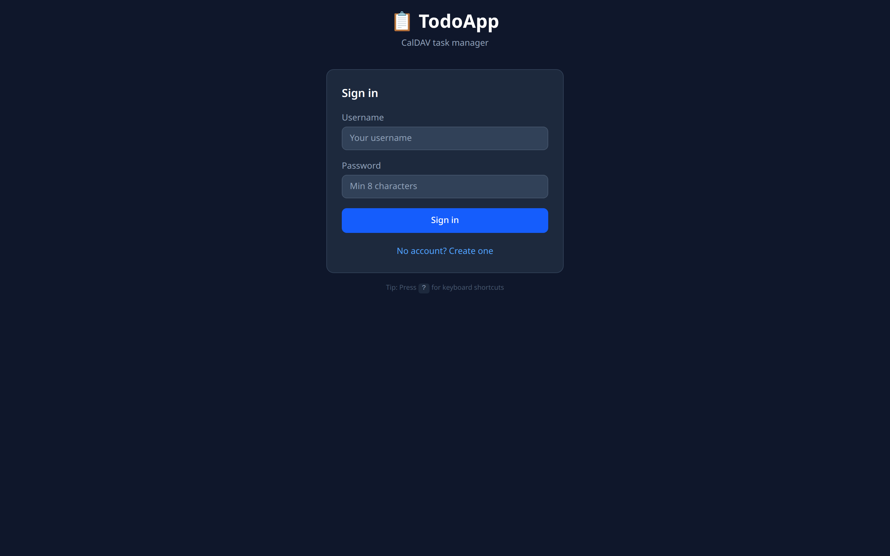

# Features

What caldav-tasks-web does, which CalDAV servers it works with, and where it stands today.

## Why

Tasks.org is the best Android task app and it syncs to CalDAV cleanly.
There is no web UI for it. This fills the gap.

If you already run Radicale for your calendars and tasks, this gives
you a touch-first PWA on top of the same data — no data migration, no
second source of truth, installable on mobile from the browser.

## Features

- Multiple CalDAV servers per account, multiple calendars per server,
  in one web UI
- Full VTODO editing: summary, description, status, priority, due date,
  start date, categories, location, recurrence, percent complete
- Inline tag filter, full-text search across summary / description /
  categories
- Filter by status or priority, hide completed, multi-sort
- Kanban view — drag todos between status columns
- Collection CRUD — create, rename, delete calendars in-place
- Server passwords encrypted with AES-GCM at rest (key from
  `ENCRYPTION_SECRET`)
- Mobile-first sidebar with overlay, works as an installed PWA
- Self-host with one Deno binary plus SQLite — no Node, no npm runtime

## Server compatibility

| Server    | Status                                 |
| --------- | -------------------------------------- |
| Radicale  | Tested in production                   |
| Stalwart  | Currently broken, not usable           |
| Nextcloud | CalDAV-compliant, expected to work     |
| Baikal    | CalDAV-compliant, expected to work     |
| Tasks.org | Tested as a peer (round-trips cleanly) |

The CalDAV protocol is standardized (RFC 4791) so any conforming
server should work.

## Screenshots

The screenshots use invented demo tasks on a local Radicale server.

## Status

Works well with Radicale. Stalwart support is currently broken, to
the point that the app is not usable with it. There is no public
demo right now. Tracked in
[issue #10](https://github.com/spy4x/caldav-tasks-web/issues/10).
